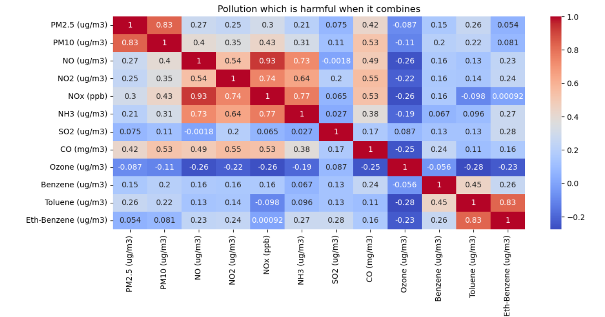
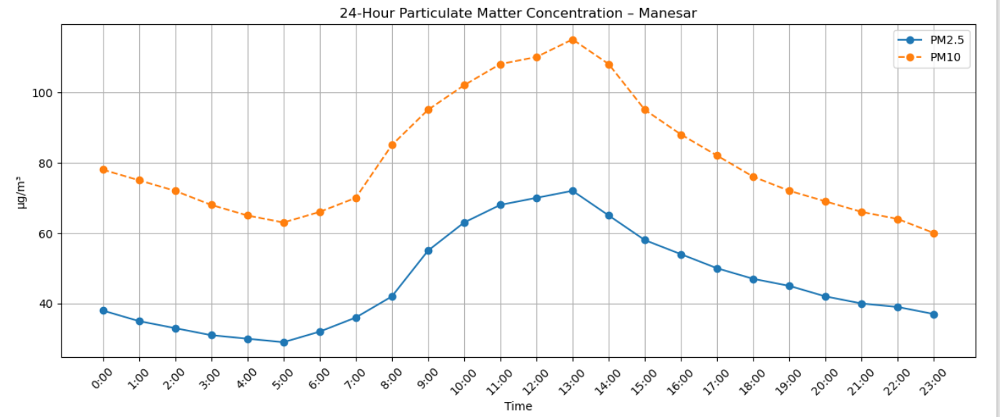
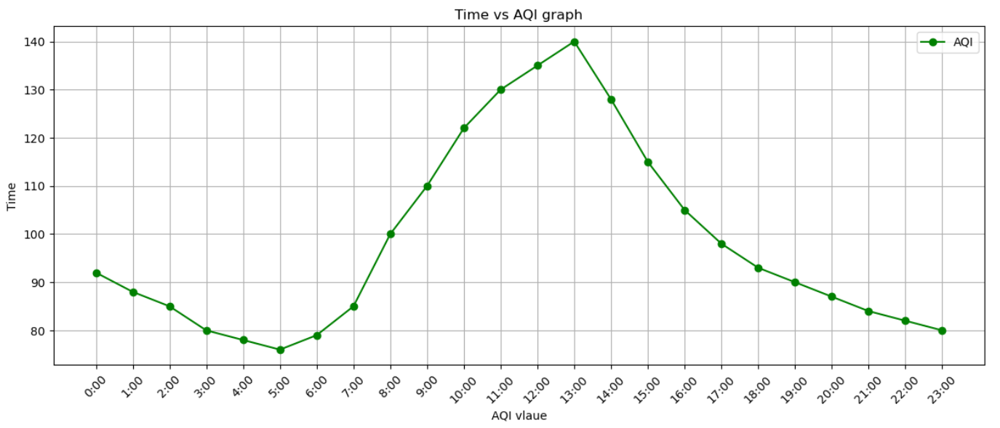
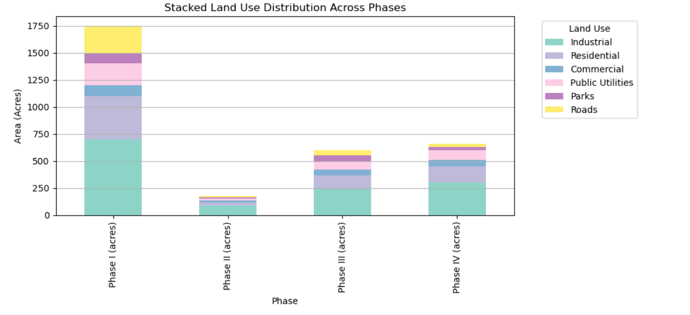

# 🌍 Environmental Analysis of Manesar (IMT Gurgaon)

This project analyzes environmental factors affecting the Manesar region (Gurgaon), using real-world data collected from public reports and sources. The goal is to visualize key pollution metrics, explore the relationship between rainfall and air quality, and understand how land has been allocated across different development phases in IMT Manesar.

---

## 📌 Objectives

- Analyze air pollution levels (PM2.5, PM10, NOx, etc.)
- Study the impact of rainfall on pollution
- Understand pollutant relationships using correlation heatmap
- Visualize land use trends across Phase I to Phase IV

---

## 📊 Visual Insights

### ✅ 1. Correlation Heatmap

### ✅ 2. PM2.5 & PM10 (Two Line Chart)

### ✅ 3. Land Use Trend (One Line Chart)

### ✅ 4. Land Use by Phase (Stacked Bar Chart)

---

## 🧠 Key Findings

- PM2.5 and PM10 levels are consistently high, indicating poor air quality
- Rainfall has a visible effect in reducing particulate matter
- Pollutants like NO2, NOx, and PM show strong correlations
- Industrial and Residential land use dominate across phases; green zones are minimal

---

## ⚠️ Limitations

Due to limited access to location-specific datasets (especially real-time AQI and biodiversity data from Manesar), this project uses baseline data extracted from environmental reports.

> 🔄 This project is a work in progress. Future updates will include:
> - Real-time air quality and rainfall APIs
> - More recent land use & urbanization data
> - Socio-economic & biodiversity metrics

---

## 🛠️ Tools Used

- Python (Pandas, Matplotlib, Seaborn)
- Jupyter Notebook
- Data Source: Public environmental reports (PDF), CSV data

---

## 👨‍💻 Author

**Harsh Vardhan Singh**  
Email:harshvs4002hs@gmail.com
---

## ⭐ Feel free to ⭐ star the repo if you found it helpful!
